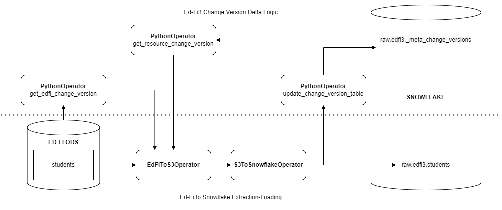
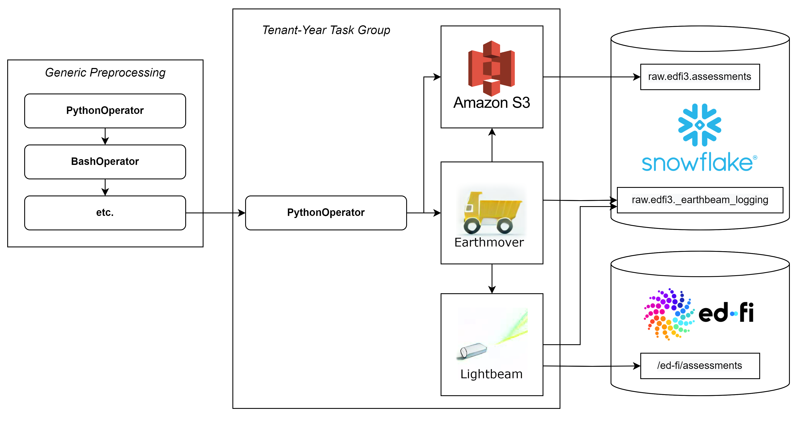

# Overview
`edu_edfi_airflow` provides Airflow hooks and operators for transforming and posting data into Ed-Fi ODS using Earthmover and Lightbeam,
and for transferring data from an Ed-Fi ODS to a Snowflake data warehouse.

This package is part of Enable Data Union (EDU).
Please visit the [EDU docs site](https://enabledataunion.org/) for more information.


# EdFiResourceDAG
`EdFiResourceDAG` is an Airflow DAG that pulls a specified selection of Ed-Fi endpoints to disk, then copies them into Snowflake.
The `EdFiToS3Operator` pulls JSON rows for a specified Ed-Fi resource and writes them locally before copying the files to S3.
The `S3ToSnowflakeOperator` copies the transferred files into the data warehouse using a Snowflake stage.

This implementation takes advantage of Ed-Fi3 change-version logic, allowing daily ingestion of ODS deltas and incorporation of resource deletes.
Although the DAG-implementation is designed for Ed-Fi3, it will work for Ed-Fi2 ODS instances, although without incremental ingestion.



To ingest only a subset of endpoints, populate the `endpoints` DAG-level config.
The names of the endpoints can be in any casing and will be forced to snake_case before being processed.

Set `full_refresh` to `True` in DAG-level configs to reset the change-version table for the specified (tenant, year).
This forces a full drop-replace of a given endpoint's data in Snowflake.
This functionality can be paired with the `endpoints` DAG-level config to run a full-refresh on a subset of endpoints.


<details>
<summary>Arguments:</summary>

| Argument                       | Description                                                                                                                        |
|:-------------------------------|:-----------------------------------------------------------------------------------------------------------------------------------|
| tenant_code                    | ODS-tenant representation to be saved in Snowflake tables                                                                          |
| api_year                       | ODS API-year to be saved in Snowflake tables                                                                                       |
| edfi_conn_id                   | Airflow connection with Ed-Fi ODS credentials and metadata defined for a specific tenant                                           |
| s3_conn_id                     | Airflow connection with S3 bucket defined under `schema`                                                                           |
| snowflake_conn_id              | Airflow connection with Snowflake credentials, database, and schema defined                                                        |
| pool                           | Airflow pool to assign EdFi-to-S3 pulls for this DAG (designed to prevent the ODS from being overwhelmed)                          |
| tmp_dir                        | Path to the temporary directory on the EC2 server where ODS data is written before their transfer to S3                            |
| multiyear                      | Boolean flag for whether the ODS has multiple years of data within one API year (defaults to `False`; dispreferred implementation) |
| use_change_version             | Boolean flag for using change versions to complete delta ingests (default `True`; turned off for Ed-Fi2)                           |
| change_version_table           | Name of the table to record resource change versions on Snowflake (defaults to `'_meta_change_versions'`)                          |
| slack_conn_id                  | Optional Airflow connection with Slack webhook credentials (default None)                                                          |
| dbt_incrementer_var            | Optional Airflow variable to increment upon a finished run                                                                         |
| schedule_interval_full_refresh | Optional CRON schedule to automatically trigger a full-refresh run (defaults to `None`)                                            |

Additional Airflow DAG parameters (e.g. `schedule_interval`, `default_args`, etc.) can be passed as kwargs.

-----

</details>


Default instantiation of these in our `int_edfi_project_template` come in the following YAML structure:
```yaml
edfi_resource_dags__default_args: &default_dag_args
  default_args: *default_task_args

  schedule_interval: null
  schedule_interval_resources: null    # Optional to provide differing schedule logic between resources and descriptors.
  schedule_interval_descriptors: null  # If either is unpopulated, `schedule_interval` will be used by default.

  # Airflow Connection IDs
  edfi_conn_id: ~
  s3_conn_id: 'data_lake'
  snowflake_conn_id: 'snowflake'

  # Variables for pulling from EdFi
  tmp_dir: '/efs/tmp_storage'
  pool: ~

  # Variables for interacting with Snowflake
  change_version_table: '_meta_change_versions'


edfi_resource_dags:
  # note that `YEAR` must match the `schoolYear` of the ODS, which will be a 4 digit integer representing the spring year, e.g. for '2022-2023' it would be 2023.
  TENANT1:
    YEAR1:
      pool: default_pool
      edfi_conn_id: 'edfi_TENANT1_YEAR1'
      schedule_interval: null
      <<: *edfi_resource_dags__default_args
  TENANT2:
    YEAR1:
      pool: default_pool
      edfi_conn_id: 'edfi_TENANT2_YEAR1'
      schedule_interval: null
      <<: *edfi_resource_dags__default_args
```

-----


## Connections

Three types of connections must be defined in Airflow to complete a full run.
Each connection is outlined below with required fields that must be populated for a successful run.
An optional Slack connection for logging run failures has also been outlined.

### Ed-Fi Connection

Each Ed-Fi connection references one API year in one ODS (unless the ODS is multiyear).
These are passed into an `EdFiHook` to an `EdFiApiClient`.

<details>
<summary>Arguments:</summary>

| Argument        | Description                                                                                                  |
|:----------------|:-------------------------------------------------------------------------------------------------------------|
| Connection Id   | Name of connection to reference in config files and across operators                                         |
| Connection Type | `HTTP`                                                                                                       |
| Host            | Base URL for the specific Ed-Fi ODS instantiation (extra pathing must be removed)                            |
| Login           | Client Key for the ODS                                                                                       |
| Password        | Client Secret for the ODS                                                                                    |
| Extra           | JSON structure with `api_mode` (required), `api_version` (default 3), and `instance_code` (optional) defined |

If `api_version` or `api_mode` are undefined in `Extra`, these will be inferred from the ODS (Ed-Fi3 only). 

-----

</details>


### AWS S3 Connection

This connection outlines the S3 datalake bucket to which Ed-Fi data is staged before transferring to Snowflake.

<details>
<summary>Arguments:</summary>

| Argument        | Description                                                                   |
|:----------------|:------------------------------------------------------------------------------|
| Connection Id   | Name of connection to reference in config files and across operators          |
| Connection Type | `S3`                                                                          |
| Schema          | S3 bucket name used to store data transferred from the Ed-Fi ODS to Snowflake |
| Login           | [Empty]; Must be defined if EC2 IAM role is not scoped                        |
| Password        | [Empty]; Must be defined if EC2 IAM role is not scoped                        |

It is recommended to extend the EC2 server's IAM role to include S3 permissions on the datalake bucket specified in `schema`.
If done correctly, `login` and `password` can be left blank and inferred automatically. 

-----

</details>


### Snowflake Connection

This connection outlines the Snowflake account to which the S3 stage and subsequent raw tables are defined.

<details>
<summary>Arguments:</summary>

| Argument        | Description                                                                                     |
|:----------------|:------------------------------------------------------------------------------------------------|
| Connection Id   | Name of connection to reference in config files and across operators                            |
| Connection Type | `Snowflake`                                                                                     |
| Host            | Host URL for the Snowflake instance                                                             |
| Schema          | Snowflake schema destination for raw Ed-Fi data                                                 |
| Login           | Snowflake Airflow loader role                                                                   |
| Password        | Snowflake loader password                                                                       |
| Extra           | JSON structure with Snowflake-specific fields (also defined below)                              |
 | Account         | Snowflake account associated with instance (`extra__snowflake__account`)                        |
| AWS Access Key  | Access key to AWS account associated with S3 bucket (`extra__snowflake__aws_access_key_id`)     |
| AWS Secret Key  | Secret key to AWS account associated with S3 bucket (`extra__snowflake__aws_secret_access_key`) |
| Database        | Snowflake database destination for raw Ed-Fi data (`extra__snowflake__database`)                |
| Region          | (Optional) AWS region associated with S3 bucket (`extra__snowflake__region`)                    |
| Role            | Snowflake loader role (`extra__snowflake__role`)                                                |
| Warehouse       | Snowflake warehouse destination for raw Ed-Fi data (`extra__snowflake__warehouse`)              |

Snowflake-specific fields can be defined either as a JSON object in `Extra`, or in the extra fields underneath.
When editing these values, it is recommended to edit the JSON object directly.
The values in the fields will update after saving the connection.

-----

</details>


### Slack Connection

This connection is used for sending Airflow task successes and failures to a dedicated Slack channel.
Channel configurations must be specified on webhook-creation.


<details>
<summary>Arguments:</summary>

| Argument        | Description                                                          |
|:----------------|:---------------------------------------------------------------------|
| Connection Id   | Name of connection to reference in config files and across operators |
| Connection Type | `Slack Webhook`                                                      |
| Host            | `https://hooks.slack.com/services`                                   |
| Password        | The trailing ID path of the webhook URL, including the initial "/"   |

-----

</details>


-----

## Hooks and Operators

### EdFiHook
This Airflow Hook connects to the Ed-Fi ODS using an `EdFiClient`.

<details>
<summary>Arguments:</summary>

| Argument     | Description                                                                         |
|:-------------|:------------------------------------------------------------------------------------|
| edfi_conn_id | Name of the Airflow connection where Ed-Fi ODS connection metadata has been defined |

-----

</details>


### EdFiToS3Operator
Transfers a specific resource (or resource deletes) from the Ed-Fi ODS to S3. 

<details>
<summary>Arguments:</summary>

| Argument                 | Description                                                                                             |
|:-------------------------|:--------------------------------------------------------------------------------------------------------|
| edfi_conn_id             | Name of the Airflow connection where Ed-Fi ODS connection metadata has been defined                     |
| resource                 | Name of Ed-Fi resource/descriptor to pull from the ODS                                                  |
| tmp_dir                  | Path to the temporary directory on the EC2 server where ODS data is written before their transfer to S3 |
| s3_conn_id               | Name of the Airflow connection where S3 connection metadata has been defined                            |
| s3_destination_key       | Destination key where Ed-Fi resource data should be written on S3                                       |
| query_parameters         | Custom parameters to apply to the pull (default `None`)                                                 |
| min_change_version       | Minimum change version to pull for the resource (default `None`)                                        |
| max_change_version       | Maximum change version to pull for the resource (default `None`)                                        |
| change_version_step_size | Window size to apply during change-version stepping (default `50000`                                    |
| api_namespace            | Namespace under which the resource is assigned (default `"ed-fi"`)                                      |
| api_get_deletes          | Boolean flag for whether to retrieve the resource's associated deletes (default `False`)                |
| api_retries              | Number of attempts the pull should make before giving up (default `5`)                                  |
| page_size                | Number of rows to pull at each GET (default `100`)                                                      |

`page_size` should be tuned per ODS and resource.
Contact your ODS-administrator to determine maximum-allowable page-size and recommendeded size to prevent overwhelming the ODS.

If either `min_change_version` or `max_change_version` are undefined, change version stepping does not occur.

-----

</details>


### S3ToSnowflakeOperator
Copies a specific S3 key to the specified table in Snowflake.
First completes a `DELETE FROM` statement if `full_refresh` is set to True in the DAG configs.

<details>
<summary>Arguments:</summary>

| Argument           | Description                                                                           |
|:-------------------|:--------------------------------------------------------------------------------------|
| tenant_code        | ODS-tenant representation to be saved in Snowflake tables                             | 
| api_year           | ODS API-year to be saved in Snowflake tables                                          |  
| resource           | Static name of Ed-Fi resource, placed in the `name` column of the destination table   |
| table_name         | Name of the raw Snowflake table to copy into on Snowflake                             |
| s3_destination_key | Source key where JSON data is saved on S3                                             |
| snowflake_conn_id  | Name of the Airflow connection where Snowflake connection metadata has been defined   | 
| edfi_conn_id       | Name of the Airflow connection where Ed-Fi ODS connection metadata has been defined   |
| ods_version        | Optional Ed-Fi ODS version to save as metadata if `edfi_conn_id` is undefined         |
| data_model_version | Optional Ed-Fi data model version to save as metadata if `edfi_conn_id` is undefined  |
| full_refresh       | Boolean flag to run a full truncate-replace of the warehouse data for the given grain |
| xcom_return        | Helper variable to specific return type on success (used for downstream XComs)        |

-----

</details>


-----

## Callables

### get_newest_edfi_change_version
Retrieves the most recent change version in the ODS using `EdFiClient.get_newest_change_version()`
Returns `None` if an Ed-Fi2 ODS, as change versions are unimplemented.

<details>
<summary>Arguments:</summary>

| Argument     | Description                                                                         |
|:-------------|:------------------------------------------------------------------------------------|
| edfi_conn_id | Name of the Airflow connection where Ed-Fi ODS connection metadata has been defined |

-----

</details>


### get_previous_change_versions
Pushes and XCom of the most recent change version for each resource of a given (tenant, year) grain saved in the Snowflake `change_version_table`.
Pushes `None` if Ed-Fi2 or if no records for this resource are found (signifying full-refresh).

Combining `get_newest_edfi_change_version` with `get_previous_change_versions` allows a `min_change_version` to `max_change_version` window to be defined for the pull.
This allows incremental ingests of resource deltas since the last pull, drastically improving runtimes when compared to full-refreshes.
Because Ed-Fi2 lacks change versions, all Ed-Fi2 pulls are full-refreshes.

<details>
<summary>Arguments:</summary>

| Argument             | Description                                                                                                           |
|:---------------------|:----------------------------------------------------------------------------------------------------------------------|
| tenant_code          | ODS-tenant representation to be saved in Snowflake tables                                                             | 
| api_year             | ODS API-year to be saved in Snowflake tables                                                                          |
| snowflake_conn_id    | Name of the Airflow connection where Snowflake connection metadata has been defined                                   |
| change_version_table | Name of the table to record resource change versions on Snowflake                                                     |

-----

</details>


### update_change_versions
Updates the change version table in Snowflake with the most recent change version for all endpoints in which data was ingested, as specified by the (tenant, year) grain.

<details>
<summary>Arguments:</summary>

| Argument             | Description                                                                                            |
|:---------------------|:-------------------------------------------------------------------------------------------------------|
| tenant_code          | ODS-tenant representation to be saved in Snowflake tables                                              | 
| api_year             | ODS API-year to be saved in Snowflake tables                                                           |
| snowflake_conn_id    | Name of the Airflow connection where Snowflake connection metadata has been defined                    |
| change_version_table | Name of the table to record resource change versions on Snowflake                                      |
| edfi_change_version  | The most recent change version present in the ODS (as retrieved from `get_newest_edfi_change_version`) |

-----

</details>


### reset_change_versions
Marks all rows in the Snowflake `change_version_table` for the specified (tenant, year) grain as inactive.

<details>
<summary>Arguments:</summary>

| Argument             | Description                                                                                            |
|:---------------------|:-------------------------------------------------------------------------------------------------------|
| tenant_code          | ODS-tenant representation to be saved in Snowflake tables                                              | 
| api_year             | ODS API-year to be saved in Snowflake tables                                                           |
| snowflake_conn_id    | Name of the Airflow connection where Snowflake connection metadata has been defined                    |
| change_version_table | Name of the table to record resource change versions on Snowflake                                      |

-----

</details>


-----

# EarthbeamDAG
`EarthbeamDAG` is a comprehensive Airflow DAG designed around transforming a raw dataset into the Ed-Fi data model.
The transformed files are sent into an Ed-Fi ODS using Lightbeam, or they are copied directly into the raw tables in Snowflake.
Two new operators, `EarthmoverOperator` and `LightbeamOperator`, provide the means to interface with Earthmover and Lightbeam through Airflow.

The `EarthbeamDAG` provides multiple optional utility functions, including:
* Saving raw and Earthmover-transformed data to S3
* Logging Earthmover and Lightbeam results to a specified logging table in Snowflake
* Dynamic preprocessing of data using Bash or Python at the DAG- and grain-level



The grain of `EarthbeamDAG` differs from that of `EdFiResourceDAG`.
Earthmover-Lightbeam runs are defined at the run-type level (i.e., the type of Earthmover process being completed).
Additionally, optional Bash and Python operations can be chained prior to task-groups
via `build_bash_preprocessing_operator` and `build_python_preprocessing_operator` respectively.

Set `force` to `True` in DAG-level configs or under a task-group's `lightbeam_kwargs` to force Lightbeam to resend payloads. 

<details>
<summary>DAG-level Arguments:</summary>

| Argument        | Description                                                                                                    |
|:----------------|:---------------------------------------------------------------------------------------------------------------|
| run_type        | Representation of the type of DAG being run (e.g., NWEA MAP assessment)                                        |
| earthmover_path | Path to installed Earthmover package                                                                           |
| lightbeam_path  | Path to installed Lightbeam package                                                                            |
| pool            | Airflow pool against which all operations are applied                                                          |
| earthmover_pool | Optional Airflow pool against which all Earthmover operations are applied (default `pool`)                     |
| lightbeam_pool  | Optional Airflow pool against which all Lightbeam operations are applied (default `pool`)                      |
| slack_conn_id   | Optional Airflow connection with Slack webhook credentials (default None)                                      |
| fast_cleanup    | Boolean flag for whether to remove local files immediately upon failure, or only after success (default False) |

Additional Airflow DAG parameters (e.g. `schedule_interval`, `default_args`, etc.) can be passed as kwargs.

-----

</details>

`EarthbeamDAG` builds task-groups for each (tenant, year), with an optional `grain_update` to distinguish runs by subject.
Task-groups are fully independent of one another, and different operations can be applied in each.
Task-groups can also apply an optional Python preprocessing callable to the raw data before running Earthmover.

<details>
<summary>Taskgroup-level Arguments:</summary>

| Argument           | Description                                                                                                                    |
|:-------------------|:-------------------------------------------------------------------------------------------------------------------------------|
| tenant_code        | ODS-tenant representation to be saved in Snowflake tables                                                                      |
| api_year           | ODS API-year to be saved in Snowflake tables                                                                                   |
| raw_dir            | Path to the directory on the EC2 server where pre-Earthmover data is found                                                     |
| grain_update       | Optional string to extend the grain of the task-group beyond (tenant, year)                                                    |
| group_id           | Optional static string-representation of the task-group (a generated name is used if undefined)                                |
| prefix_group_id    | Optional boolean flag for whether to prefix the name of task-group operators with the `group_id` (default False)               |
| earthmover_kwargs  | Kwarg command-line arguments to be passed into `EarthmoverOperator`                                                            |
| edfi_conn_id       | Airflow connection with Ed-Fi ODS credentials and metadata defined for a specific tenant                                       |
| lightbeam_kwargs   | Kwarg command-line arguments to be passed into `LightbeamOperator`                                                             |
| s3_conn_id         | Airflow connection with S3 bucket defined under `schema`                                                                       |
| s3_filepath        | S3 root key to copy staging data to before and after running Earthmover                                                        |
| python_callable    | Optional Python callable to run at the start of the task-group prior to Earthmover                                             |
| python_kwargs      | Optional kwargs to pass into `python_callable`                                                                                 |
| snowflake_conn_id  | Optional Airflow connection with Snowflake credentials, database, and schema defined                                           |
| logging_table      | Optional name of a table to record Earthmover and Lightbeam results to in Snowflake                                            |
| ods_version        | Optional Ed-Fi ODS version to save as metadata if copying data directly into the ODS                                           |
| data_model_version | Optional Ed-Fi data model version to save as metadata if copying data directly into the ODS                                    |
| endpoints          | Optional list of resource/descriptor endpoints to copy data directly into the ODS (these should align with Earthmover outputs) |
| full_refresh       | Boolean flag to run a full truncate-replace of the warehouse data for the given grain if copying data directly into the ODS    |

-----

</details>

XComs can be passed between tasks in a tenant-year taskgroup
(e.g., referencing return values from the Python preprocessing task to `earthmover_kwargs`).
When passing XComs in this manner, make sure to include the name of the task-group ID in the referenced task ID.

For example, to reference the optional Python preprocessing task at the beginning of a task-group,
use one of the following (depending on whether the optional argument `grain_update` is defined):
```python
"{{ ti.xcom_pull(task_ids='{group_id}.{tenant_code}_{api_year}__python_preprocess', key='return_value') }}"
"{{ ti.xcom_pull(task_ids='{group_id}.{tenant_code}_{api_year}_{grain_update}__python_preprocess', key='return_value') }}"
```

Task-group IDs are built dynamically, depending on the type of processing being completed.
If you are using XComs in this manner, it is recommended to use the optional `group_id` argument when initializing
your task-group to ensure that its value is static and easily-referenced in your DAG-initialization code.


-----

## Operators

### EarthmoverOperator
Extends `BashOperator` to run Earthmover with optional CLI arguments.

<details>
<summary>Arguments:</summary>

| Argument        | Description                                                                                           |
|:----------------|:------------------------------------------------------------------------------------------------------|
| earthmover_path | Path to installed Earthmover package                                                                  | 
| output_dir      | Directory to output files created by Earthmover (also definable within the config file)               |  
| state_file      | Path to file where Earthmover saves state between runs  (also definable within the config file)       |
| config_file     | Path to the Earthmover config file to run                                                             |
| selector        | Optional selector string to filter Earthmover run                                                     |
| parameters      | Optional `params` JSON payload to pass into Earthmover                                                | 
| results_file    | Optional path to save results payload after run                                                       |
| force           | Boolean flag to force an Earthmover run, even if nothing has changed since last run (default `False`) |
| skip_hashing    | Boolean flag to force Earthmover to skip hashing before run (default `False`)                         |
| show_graph      | Boolean flag to generate graph .png and .svg files (default `False`)                                  |
| show_stacktrace | Boolean flag to display full stacktrace in the case of an error (default `False`)                     |

-----

</details>


### LightbeamOperator
Extends `BashOperator` to run Lightbeam with optional CLI arguments.

<details>
<summary>Arguments:</summary>

| Argument            | Description                                                                                                                       |
|:--------------------|:----------------------------------------------------------------------------------------------------------------------------------|
| lightbeam_path      | Path to installed Ligthbeam package                                                                                               | 
| command             | Lightbeam run command (i.e., `send`, `send+validate`, `validate`, `delete`) (default `send`)                                      | 
| data_dir            | Directory of files for Lightbeam to use (also definable within the config file)                                                   |  
| state_dir           | Path to directory where Lightbeam saves state between runs  (also definable within the config file)                               |
| edfi_conn_id        | Optional Airflow connection with Ed-Fi ODS credentials (if present, fills config environment variables prefixed with `EDFI_API_`) |
| config_file         | Path to the Lightbeam config file to run                                                                                          |
| selector            | Optional selector string to filter Lightbeam run                                                                                  |
| parameters          | Optional `params` JSON payload to pass into Lightbeam                                                                             | 
| results_file        | Optional path to save results payload after run                                                                                   |
| wipe                | Boolean flag to force a cache-reset and re-fetch API metadata (default `False`)                                                   |
| force               | Boolean flag to force a Lightbeam run, even if payloads have already been sent (default `False`)                                  |
| older_than          | Optional timestamp string to filter payloads against when re-running Lightbeam                                                    |
| newer_than          | Optional timestamp string to filter payloads against when re-running Lightbeam                                                    |
| resend_status_codes | Optional list of status-codes to filter payloads against when re-running Lightbeam                                                |

-----

</details>

-----


## Callables

### insert_into_snowflake
Generic callable to insert a list of rows into a specified Snowflake table.
This callable utilizes `SnowflakeHook.insert_rows()`.

Note: this method requires the length of `columns` to match the length of each row being inserted in `values`.

<details>
<summary>Arguments:</summary>

| Argument          | Description                                                                         |
|:------------------|:------------------------------------------------------------------------------------|
| snowflake_conn_id | Name of the Airflow connection where Snowflake connection metadata has been defined |
| table_name        | Name of the table to insert rows into                                               |
| columns           | Name of the columns to insert                                                       |
| values            | A single row or list of rows to insert                                              |

-----

</details>


### local_filepath_to_s3
Generic callable to upload files within a local filepath to a specified S3 bucket and key.
This callable works on either a single file or a directory of files.

<details>
<summary>Arguments:</summary>

| Argument              | Description                                                                                             |
|:----------------------|:--------------------------------------------------------------------------------------------------------|
| local_filepath        | A filepath or directory path to upload to S3                                                            |
| s3_destination_key    | An S3 key or root where the local file or directory is uploaded, respectively                           |
| s3_conn_id            | Name of the S3 connection in Airflow where the bucket has been defined                                  |
| remove_local_filepath | Boolean flag for whether to delete the contents of `local_filepath` at run completion (default `False`) |

-----

</details>


### remove_filepaths
Generic callable to delete a list of files or directories on local disk.
This method works on both filepaths and directory paths.

<details>
<summary>Arguments:</summary>

| Argument   | Description                                        |
|:-----------|:---------------------------------------------------|
| filepaths  | A single filepath or a list of filepaths to delete |

-----

</details>
